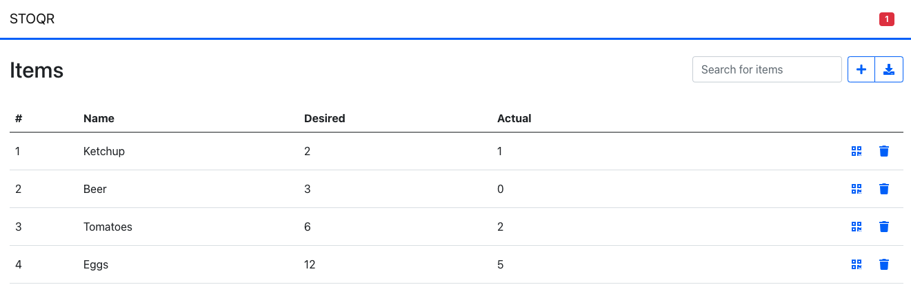

# STOQR

Manage your stock scanning QR codes.

## Overview



## Deployment

To deploy STOQR use the included Helm chart:

```bash
kubectl create namespace stoqr

helm install stoqr ./stoqr-chart --wait --set url=stoqr.veicot.io -n stoqr
```

**NOTE**: Set the url variable accordingly.

As a result, you'll see the following output:

```
Manage your stock scanning QR codes.

  ____ _____ ___   ___  ____  
 / ___|_   _/ _ \ / _ \|  _ \ 
 \___ \ | || | | | | | | |_) |
  ___) || || |_| | |_| |  _ < 
 |____/ |_| \___/ \__\_\_| \_\


 Visit the application at http://stoqr.veicot.io
```
